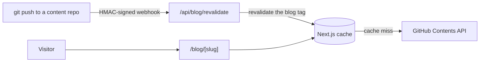

# kylehagerman.dev

Here's the code to my personal website, live at
**[kylehagerman.dev](https://www.kylehagerman.dev)**!

A bit about me: I'm Kyle, a Software and Biomedical Engineering student at
McMaster University. The site is the ocean of my mind, a portfolio full of my
experiences and whatever drifts through my thoughts. I love experimenting with
new technology and I'll always say "yes" to the craziest ideas.

Below you'll find the setup instructions and some cool info about how it works.

---

## What's inside

| Page          | What it does                                                                                           |
| ------------- | ------------------------------------------------------------------------------------------------------ |
| `/`           | Hero with a liquid-glass card, a glitching title, and a three.js particle ocean behind it              |
| `/projects`   | Project cards in three switchable styles; switching makes every card shake, pop, and swap in formation |
| `/experience` | A timeline of where I've worked                                                                        |
| `/about-me`   | The long version, with a short video (and transcript) for each section                                 |
| `/gallery`    | A photo wall served as responsive AVIF/WebP from Cloudflare R2                                         |
| `/blog`       | Markdown posts pulled straight from GitHub repos, with an RSS feed                                     |
| `/contact`    | A contact form that sends through Resend                                                               |

## Cool stuff under the hood

**The blog has no CMS. It reads GitHub.** Posts live as markdown in a private
repo (plus any public repos I mount alongside it). The site reads them through
the GitHub Contents API, and a signed webhook revalidates the cache on every
push. A public repo keeps its own history, stars, and PRs, and its posts still
show up here.



**Some posts are locked.** They open with a per-post password or a master
password. Locked posts are `noindex` and never go in the sitemap.

**View analytics without storing IPs.** Blog views go into Postgres keyed by
a daily hash of IP + a secret salt + the UTC date. That's enough to count unique
visitors in a day, and it can't be turned back into an address. Bot traffic is
swept out, and too many bot views triggers an email alert.

**Project cards choreograph their exit.** Switching card styles runs a
coordinated exit (checkerboard, popcorn, or center-out), waits for every card
to pop, swaps the variant, and plays the entrance. It's all built on one
reusable `PopCard` primitive.

**Every page gets its own social preview.** OpenGraph images are generated
per route and per blog post with `next/og`, so links look right when shared.

**The photo wall is static HTML.** `pnpm photos` takes a folder of iPhone
exports (HEIC included), reads the EXIF capture dates, and writes resized
AVIF/WebP sets plus a manifest that gets committed. The page fetches nothing at
runtime.

**Radius means something.** Chips are `rounded-full`, buttons are
`rounded-lg`, surfaces are `rounded-xl`, and exactly one component gets
`rounded-3xl`. The [style guide](./guides/style-guide.md) has the full set of
rules.

## Tech stack

- [Next.js 15](https://nextjs.org) (App Router, Turbopack) + React 19 + TypeScript
- [Tailwind CSS v4](https://tailwindcss.com) with three custom palettes: `lush`, `breeze`, `nebula`
- [Motion](https://motion.dev) for UI animation, [three.js](https://threejs.org) via React Three Fiber for backgrounds
- [Radix UI](https://www.radix-ui.com) primitives, [lucide](https://lucide.dev) icons
- [Supabase](https://supabase.com) for auth and Postgres, [Resend](https://resend.com) for email
- [Cloudflare R2](https://developers.cloudflare.com/r2/) for video and photos, [Vercel](https://vercel.com) for hosting

## Running it locally

You need Node 22 and [pnpm](https://pnpm.io).

```bash
git clone https://github.com/HagOrMan/Personal-Website.git
cd Personal-Website
pnpm install
cp .env.example .env.local   # then fill in what you need
pnpm dev
```

Open [http://localhost:3000](http://localhost:3000).

Most of the site runs with just `NEXT_PUBLIC_SITE_URL` set. Each group of
variables in [`.env.example`](./.env.example) turns on one feature, and every
one is documented inline:

| Feature                     | Variables                                                                        |
| --------------------------- | -------------------------------------------------------------------------------- |
| Blog content                | `BLOG_PAT_TOKEN`, `BLOG_GITHUB_OWNER`, `BLOG_GITHUB_REPO`                        |
| Locked posts                | `BLOG_MASTER_PASSWORD`, `BLOG_SESSION_SECRET`                                    |
| Push-to-publish webhook     | `BLOG_REVALIDATE_SECRET`                                                         |
| Owner sign-in               | `NEXT_PUBLIC_SUPABASE_URL`, `NEXT_PUBLIC_SUPABASE_ANON_KEY`, `BLOG_OWNER_USER_IDS` |
| View analytics              | `SUPABASE_SECRET_KEY`, `ANALYTICS_IP_SALT` (run `supabase/migrations/*.sql` first) |
| Contact form                | `RESEND_API_KEY`, `CONTACT_EMAIL_TO`                                             |
| Database keep-alive cron    | `CRON_SECRET`                                                                    |
| Videos and photos           | `NEXT_PUBLIC_R2_BASE_URL`                                                        |

### Scripts

| Command          | Does                                                     |
| ---------------- | -------------------------------------------------------- |
| `pnpm dev`       | Dev server with Turbopack                                |
| `pnpm build`     | Production build                                         |
| `pnpm start`     | Serve the production build                               |
| `pnpm typecheck` | `tsc --noEmit`                                           |
| `pnpm lint`      | ESLint (`lint:fix` to autofix)                           |
| `pnpm photos`    | Process `photos-src/` into the gallery (see [scripts/README.md](./scripts/README.md)) |

## Project layout

```
src/
├── app/          routes (App Router); each page.tsx is a server component
├── components/   UI, grouped by page or role (layout, ui, backgrounds, blog, ...)
├── constant/     static data: projects, nav items, socials, card variants
├── lib/          blog engine, SEO, Supabase, Resend, utils
└── data/         generated manifests (photos.json)
supabase/         SQL migrations for the analytics table
scripts/          photo and project-asset pipelines
guides/           design and ops docs
```

## Guides

Project documentation lives in [`guides/`](./guides):

- [**Style guide**](./guides/style-guide.md) — the design rules this site
  follows (radius, actions, colour tokens, layout measure, icons, motion) and
  the traps that have already cost time. Read before adding or restyling a
  component.
- [Project metadata](./guides/project-metadata.md) — generating a
  `src/constant/projects.ts` entry from a project's own repo.
- [Auth](./guides/auth.md) — the blog's GitHub sign-in and locked posts.
- PageSpeed audits: [site](./guides/pagespeed-audit.md),
  [about-me](./guides/pagespeed-audit-about-me.md),
  [blog](./guides/pagespeed-audit-blog.md).
- [WEBSITES.md](./WEBSITES.md) — which external services the site uses
  (domain, DNS, hosting, OAuth, storage) and where each one is configured.

`CLAUDE.md` carries an architecture overview and the subset of style rules most
often broken by accident.

## Using this as a template

Go for it. Please swap out my name, photos, videos, and writing first. The
code is yours to borrow; the content is mine.

---

<p align="center"><sub>Built one wave at a time 🌊</sub></p>
